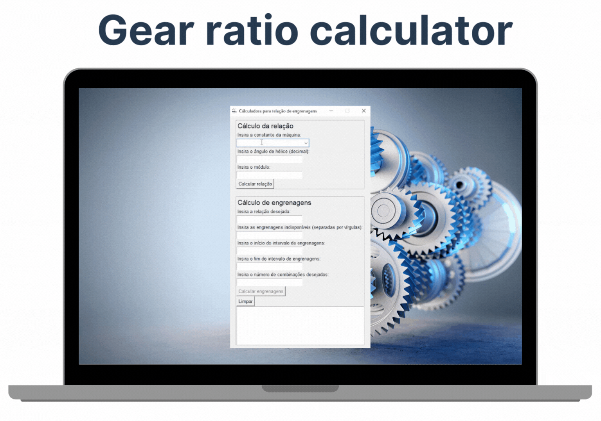

# Calculadora de Engrenagens - Gear ratio calculator

## Sobre o Projeto

Este projeto é uma aplicação Python com interface gráfica Tkinter. Seu principal objetivo é calcular a relação e a combinações de engrenagens. A aplicação é particularmente útil para identificar conjuntos de engrenagens adequados para máquinas de geração de dentes convencionais. Com apenas informaçoes básicas como a constante da máquina, angulo de hélice e módulo, pode se obter a relação.

## Complexidade do Cálculo de Engrenagens

O cálculo de combinações de engrenagens envolve considerações complexas, incluindo o uso de números primos. Alguns pontos importantes:

- **Precisão da Relação**: Encontrar combinações de quatro engrenagens que correspondam exatamente à relação desejada com números inteiros é um desafio, especialmente quando certas engrenagens não estão disponíveis.

- **Números Primos**: A utilização de engrenagens com números de dentes primos é comum devido às características únicas no cálculo. Esses números impactam diretamente a seleção de combinações viáveis e aumentam a complexidade do problema.

- **Aplicabilidade Prática**: A aplicação prática desses cálculos é crucial para configurar máquinas de geração de dentes de forma eficiente.

<p  align="center">



</p>

**Observações**: 
- O angulo de hélice deve ser informado em decimal, exemplo 18° 30', deve ser informado 18,5 graus.
- Se o perfil do dentado for diametral pitch, deve ser convertido para módulo.

## Tecnologias Utilizadas

- **Python**: Linguagem de programação.
- **Tkinter**: Biblioteca para interfaces gráficas em Python.

## Instalação

Para instalar as dependências necessárias, siga os passos abaixo:

1. Clone o repositório ou baixe o código-fonte.
2. Navegue até o diretório do projeto.
3. Instale as dependências usando o arquivo `requirements.txt`:
   ```
   pip install -r requirements.txt
   ```

## Execução do Projeto

Após a instalação das dependências, execute o projeto com o comando:

```
python app.py
```

## Criando um Arquivo Executável

Para converter o script `app.py` em um arquivo executável:

1. Instale o PyInstaller:
   ```
   pip install pyinstaller
   ```
2. No terminal, navegue até o diretório do projeto.
3. Execute o comando:
   ```
   pyinstaller --onefile app.py
   ```
4. O executável será encontrado na pasta `dist`.


